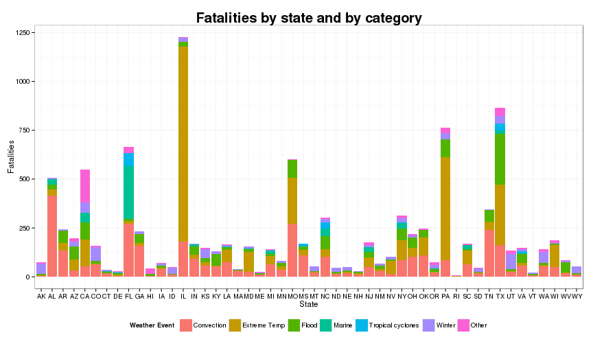
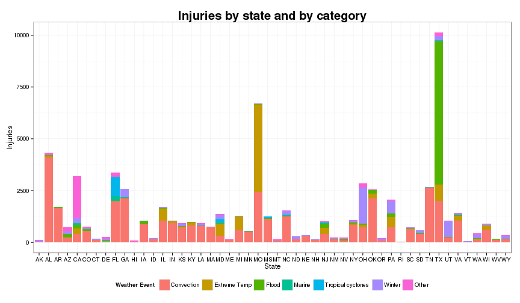
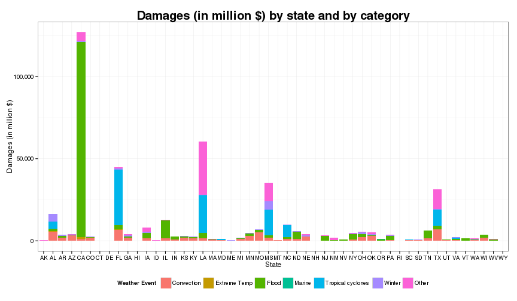

Summary of Severe Weather Events Statistics across the USA (1993-2011)
========================================================

**P. Paquay**

# Synopsis

This study uses a Storm database from the The U.S. National Oceanic and Atmospheric Administration (NOAA) to determine which types of weather events are most harmful and which types have the greatest economic consequences across the USA.

To realize this study we did a lot of data cleaning (dates in Date format, property and crop damages in a computable format, subsetting on dates from 1993, subsetting on US states, ...). We also grouped the weather event types in seven categories for ease of readability as the number of unique values is too large to manage without these categories.

The results are presented in three different plots and six different tables.

# Data processing

## Locales

First we need to set the locales to the English language.


```r
Sys.setlocale(locale = "en_GB.UTF-8")
```

```
## [1] "LC_CTYPE=en_GB.UTF-8;LC_NUMERIC=C;LC_TIME=en_GB.UTF-8;LC_COLLATE=en_GB.UTF-8;LC_MONETARY=en_GB.UTF-8;LC_MESSAGES=fr_BE.UTF-8;LC_PAPER=fr_BE.UTF-8;LC_NAME=C;LC_ADDRESS=C;LC_TELEPHONE=C;LC_MEASUREMENT=fr_BE.UTF-8;LC_IDENTIFICATION=C"
```


## Software environment

The details about the software environment used for this analysis is given by the sessionInfo() function.


```r
sessionInfo()
```

```
## R version 3.1.0 (2014-04-10)
## Platform: x86_64-pc-linux-gnu (64-bit)
## 
## locale:
##  [1] LC_CTYPE=en_GB.UTF-8       LC_NUMERIC=C              
##  [3] LC_TIME=en_GB.UTF-8        LC_COLLATE=en_GB.UTF-8    
##  [5] LC_MONETARY=en_GB.UTF-8    LC_MESSAGES=fr_BE.UTF-8   
##  [7] LC_PAPER=fr_BE.UTF-8       LC_NAME=C                 
##  [9] LC_ADDRESS=C               LC_TELEPHONE=C            
## [11] LC_MEASUREMENT=fr_BE.UTF-8 LC_IDENTIFICATION=C       
## 
## attached base packages:
## [1] stats     graphics  grDevices utils     datasets  methods   base     
## 
## other attached packages:
## [1] scales_0.2.4    plyr_1.8        ggplot2_0.9.3.1 knitr_1.5      
## 
## loaded via a namespace (and not attached):
##  [1] codetools_0.2-8  colorspace_1.2-4 digest_0.6.3     evaluate_0.5.5  
##  [5] formatR_0.10     grid_3.1.0       gtable_0.1.2     MASS_7.3-33     
##  [9] munsell_0.4.2    proto_0.3-10     reshape2_1.2.2   stringr_0.6.2   
## [13] tools_3.1.0
```


## Reading data

This phase consists simply in downloading the .csv.bz2 file with the download.file() function and reading the .csv file into a data frame named "storm.data".


```r
download.file("https://d396qusza40orc.cloudfront.net/repdata/data/StormData.csv.bz2", 
    "StormData.csv.bz2", method = "curl")
storm.data <- read.csv(bzfile("StormData.csv.bz2"), stringsAsFactors = FALSE)
```


The "storm.data" data frame has 902297 rows and 37 columns.

## Cleaning data

We begin by creating a new variable "date" in the "storm.data" dataset by coercing the "BGN_DATE" variable into a Date format variable.


```r
storm.data$date <- as.Date(storm.data$BGN_DATE, format = "%m/%d/%Y")
```


Then we create a new variable "prop.damage" in the "storm.data" dataset by using the "PROPDMG" as the coefficient and "PROPDMGEXP" as the exponent of the base 10 power (with B = 9, M = 6, K = 3, H = 2). We proceed in a similar way to create the variable "crop.damage".


```r
storm.data$prop.damage <- rep(0, nrow(storm.data))
storm.data$prop.damage <- ifelse(storm.data$PROPDMGEXP == "B", storm.data$PROPDMG * 
    1e+09, ifelse(storm.data$PROPDMGEXP %in% c("M", "m"), storm.data$PROPDMG * 
    1e+06, ifelse(storm.data$PROPDMGEXP == "K", storm.data$PROPDMG * 1000, ifelse(storm.data$PROPDMGEXP %in% 
    c("H", "h"), storm.data$PROPDMG * 100, ifelse(storm.data$PROPDMGEXP %in% 
    seq("0":"9"), storm.data$PROPDMG * 10^as.numeric(as.character(storm.data$PROPDMGEXP)), 
    storm.data$PROPDMG)))))
```

```
## Warning: NAs introduits lors de la conversion automatique
```

```r

storm.data$crop.damage <- rep(0, nrow(storm.data))
storm.data$crop.damage <- ifelse(storm.data$CROPDMGEXP == "B", storm.data$CROPDMG * 
    1e+09, ifelse(storm.data$CROPDMGEXP %in% c("M", "m"), storm.data$CROPDMG * 
    1e+06, ifelse(storm.data$CROPDMGEXP == "K", storm.data$CROPDMG * 1000, ifelse(storm.data$CROPDMGEXP %in% 
    c("H", "h"), storm.data$CROPDMG * 100, ifelse(storm.data$CROPDMGEXP %in% 
    seq("0":"9"), storm.data$CROPDMG * 10^as.numeric(as.character(storm.data$CROPDMGEXP)), 
    storm.data$CROPDMG)))))
```

```
## Warning: NAs introduits lors de la conversion automatique
```


## Creating categories

We will use seven categories as suggested by the "Summary of Natural Hazard Statistics for 2009 in the United States" from the National Weather Service (NWS) :
- *Convection* (lightning, tornado, thunderstorm and hail).
- *Extreme Temperatures* (cold and heat).
- *Flood* (flash flood and river flood).
- *Marine* (coastal storm, tsunami and rip current).
- *Tropical Cyclones* (tropical storm and hurricane).
- *Winter* (winter storm, ice and avalanche).
- *Other* (drought, dust storm, dust devil, ...).

To create these categories we will use several regular expressions namely "ind.convection", "ind.ext.temp", "ind.flood", "ind.marine", "ind.trop.cycl" and "ind.winter".


```r
ind.convection <- "\\bL\\S+?G\\b|(NADO)|(\\bTOR\\S+?O\\b|(\\bFUN))|THUNDERSTORM|TSTM|(WIND)|(WND)|HAIL"
ind.ext.temp <- "COLD|HEAT|HYPERTHERMIA|HYPOTHERMIA|LOW TEMPERATURE|RECORD HIGH|RECORD LOW|Record temperature|RECORD WARM|Temperature record|UNSEASONABLY COOL|UNSEASONABLY HOT|UNUSUAL WARMTH|UNUSUAL/RECORD WARMTH|UNUSUALLY WARM|VERY WARM|WARM WEATHER|WARM DRY CONDITIONS|RECORD COLD"
ind.flood <- "(\\bFL\\S+?D)|RAIN|PRECIP|SHOWER"
ind.marine <- "^COASTAL(\\s)?STORM$|TSUNAMI|^RIP CUR"
ind.trop.cycl <- "HURRICANE|TROPICAL STORM"
ind.winter <- "(SNOW)|(ICE)|(ICY)|(FREEZ)|(WINT)|AVALAN|FROST|LOW TEMP|BLIZZARD"
```


Below you'll find the values of the "EVTYPE" variable placed into the *Convection* category.


```r
sort(unique(grep(ind.convection, storm.data$EVTYPE, ignore.case = TRUE, value = TRUE)))
```

```
##   [1] "BITTER WIND CHILL"              "BITTER WIND CHILL TEMPERATURES"
##   [3] "BLIZZARD AND EXTREME WIND CHIL" "BLIZZARD/HIGH WIND"            
##   [5] "BLOWING SNOW & EXTREME WIND CH" "BLOWING SNOW- EXTREME WIND CHI"
##   [7] "BLOWING SNOW/EXTREME WIND CHIL" "COLD AIR FUNNEL"               
##   [9] "COLD AIR FUNNELS"               "COLD AIR TORNADO"              
##  [11] "COLD/WIND CHILL"                "COLD WIND CHILL TEMPERATURES"  
##  [13] "COLD/WINDS"                     "DEEP HAIL"                     
##  [15] "DOWNBURST WINDS"                "DRY MICROBURST WINDS"          
##  [17] "DRY MIRCOBURST WINDS"           "DUST STORM/HIGH WINDS"         
##  [19] "EXTREME COLD/WIND CHILL"        "EXTREME WINDCHILL"             
##  [21] "EXTREME WIND CHILL"             "EXTREME WIND CHILL/BLOWING SNO"
##  [23] "EXTREME WIND CHILLS"            "EXTREME WINDCHILL TEMPERATURES"
##  [25] "FLASH FLOODING/THUNDERSTORM WI" "FLASH FLOOD WINDS"             
##  [27] "FLOOD/RAIN/WIND"                "FLOOD/RAIN/WINDS"              
##  [29] "Flood/Strong Wind"              "FUNNEL"                        
##  [31] "Funnel Cloud"                   "FUNNEL CLOUD"                  
##  [33] "FUNNEL CLOUD."                  "FUNNEL CLOUD/HAIL"             
##  [35] "FUNNEL CLOUDS"                  "FUNNELS"                       
##  [37] "gradient wind"                  "Gradient wind"                 
##  [39] "GRADIENT WIND"                  "GRADIENT WINDS"                
##  [41] "GUSTNADO"                       "GUSTNADO AND"                  
##  [43] "GUSTY LAKE WIND"                "GUSTY THUNDERSTORM WIND"       
##  [45] "GUSTY THUNDERSTORM WINDS"       "Gusty Wind"                    
##  [47] "GUSTY WIND"                     "GUSTY WIND/HAIL"               
##  [49] "GUSTY WIND/HVY RAIN"            "Gusty wind/rain"               
##  [51] "Gusty winds"                    "Gusty Winds"                   
##  [53] "GUSTY WINDS"                    "HAIL"                          
##  [55] "Hail(0.75)"                     "HAIL 075"                      
##  [57] "HAIL 0.75"                      "HAIL 088"                      
##  [59] "HAIL 0.88"                      "HAIL 100"                      
##  [61] "HAIL 1.00"                      "HAIL 125"                      
##  [63] "HAIL 150"                       "HAIL 175"                      
##  [65] "HAIL 1.75"                      "HAIL 1.75)"                    
##  [67] "HAIL 200"                       "HAIL 225"                      
##  [69] "HAIL 275"                       "HAIL 450"                      
##  [71] "HAIL 75"                        "HAIL 80"                       
##  [73] "HAIL 88"                        "HAIL ALOFT"                    
##  [75] "HAIL DAMAGE"                    "HAIL FLOODING"                 
##  [77] "HAIL/ICY ROADS"                 "HAILSTORM"                     
##  [79] "HAIL STORM"                     "HAILSTORMS"                    
##  [81] "HAIL/WIND"                      "HAIL/WINDS"                    
##  [83] "Heavy Rain and Wind"            "HEAVY RAIN/LIGHTNING"          
##  [85] "HEAVY RAIN; URBAN FLOOD WINDS;" "HEAVY RAIN/WIND"               
##  [87] "HEAVY SNOW AND HIGH WINDS"      "HEAVY SNOW AND STRONG WINDS"   
##  [89] "HEAVY SNOW/HIGH WIND"           "HEAVY SNOW/HIGH WINDS"         
##  [91] "HEAVY SNOW/HIGH WINDS & FLOOD"  "HEAVY SNOW/HIGH WINDS/FREEZING"
##  [93] "HEAVY SNOW/WIND"                "Heavy surf and wind"           
##  [95] "High Wind"                      "HIGH WIND"                     
##  [97] "HIGH WIND 48"                   "HIGH WIND 63"                  
##  [99] "HIGH WIND 70"                   "HIGH WIND AND HEAVY SNOW"      
## [101] "HIGH WIND AND HIGH TIDES"       "HIGH WIND AND SEAS"            
## [103] "HIGH WIND/BLIZZARD"             "HIGH WIND/ BLIZZARD"           
## [105] "HIGH WIND/BLIZZARD/FREEZING RA" "HIGH WIND DAMAGE"              
## [107] "HIGH WIND (G40)"                "HIGH WIND/HEAVY SNOW"          
## [109] "HIGH WIND/LOW WIND CHILL"       "HIGH WINDS"                    
## [111] "HIGH  WINDS"                    "HIGH WINDS/"                   
## [113] "HIGH WINDS 55"                  "HIGH WINDS 57"                 
## [115] "HIGH WINDS 58"                  "HIGH WINDS 63"                 
## [117] "HIGH WINDS 66"                  "HIGH WINDS 67"                 
## [119] "HIGH WINDS 73"                  "HIGH WINDS 76"                 
## [121] "HIGH WINDS 80"                  "HIGH WINDS 82"                 
## [123] "HIGH WINDS AND WIND CHILL"      "HIGH WINDS/COASTAL FLOOD"      
## [125] "HIGH WINDS/COLD"                "HIGH WINDS DUST STORM"         
## [127] "HIGH WIND/SEAS"                 "HIGH WINDS/FLOODING"           
## [129] "HIGH WINDS/HEAVY RAIN"          "HIGH WINDS HEAVY RAINS"        
## [131] "HIGH WINDS/SNOW"                "HIGH WIND/WIND CHILL"          
## [133] "HIGH WIND/WIND CHILL/BLIZZARD"  "HURRICANE OPAL/HIGH WINDS"     
## [135] "ICE/STRONG WINDS"               "LATE SEASON HAIL"              
## [137] "LIGHTING"                       "LIGHTNING"                     
## [139] " LIGHTNING"                     "LIGHTNING."                    
## [141] "LIGHTNING AND HEAVY RAIN"       "LIGHTNING AND THUNDERSTORM WIN"
## [143] "LIGHTNING AND WINDS"            "LIGHTNING DAMAGE"              
## [145] "LIGHTNING FIRE"                 "LIGHTNING/HEAVY RAIN"          
## [147] "LIGHTNING INJURY"               "LIGHTNING THUNDERSTORM WINDS"  
## [149] "LIGHTNING THUNDERSTORM WINDSS"  "LIGHTNING  WAUSEON"            
## [151] "LIGNTNING"                      "LOW WIND CHILL"                
## [153] "MARINE HAIL"                    "MARINE HIGH WIND"              
## [155] "MARINE STRONG WIND"             "MARINE THUNDERSTORM WIND"      
## [157] "MARINE TSTM WIND"               "MICROBURST WINDS"              
## [159] "NON SEVERE HAIL"                "NON-SEVERE WIND DAMAGE"        
## [161] "NON TSTM WIND"                  "NON-TSTM WIND"                 
## [163] "RAIN AND WIND"                  "RAIN/WIND"                     
## [165] "RECORD COLD AND HIGH WIND"      "SEVERE THUNDERSTORM"           
## [167] "SEVERE THUNDERSTORMS"           "SEVERE THUNDERSTORM WINDS"     
## [169] "small hail"                     "Small Hail"                    
## [171] "SMALL HAIL"                     "SNOW AND WIND"                 
## [173] "SNOW/HIGH WINDS"                "SNOW- HIGH WIND- WIND CHILL"   
## [175] "STORM FORCE WINDS"              "Strong Wind"                   
## [177] "STRONG WIND"                    "STRONG WIND GUST"              
## [179] "Strong winds"                   "Strong Winds"                  
## [181] "STRONG WINDS"                   "THUDERSTORM WINDS"             
## [183] "THUNDEERSTORM WINDS"            "THUNDERESTORM WINDS"           
## [185] "THUNDERSTORM"                   "THUNDERSTORM DAMAGE"           
## [187] "THUNDERSTORM DAMAGE TO"         "THUNDERSTORM HAIL"             
## [189] "THUNDERSTORMS"                  "THUNDERSTORMS WIND"            
## [191] "THUNDERSTORMS WINDS"            "THUNDERSTORMW"                 
## [193] "THUNDERSTORMW 50"               "Thunderstorm Wind"             
## [195] "THUNDERSTORM WIND"              "THUNDERSTORM WIND."            
## [197] "THUNDERSTORM WIND 50"           "THUNDERSTORM WIND 52"          
## [199] "THUNDERSTORM WIND 56"           "THUNDERSTORM WIND 59"          
## [201] "THUNDERSTORM WIND 59 MPH"       "THUNDERSTORM WIND 59 MPH."     
## [203] "THUNDERSTORM WIND 60 MPH"       "THUNDERSTORM WIND 65MPH"       
## [205] "THUNDERSTORM WIND 65 MPH"       "THUNDERSTORM WIND 69"          
## [207] "THUNDERSTORM WIND 98 MPH"       "THUNDERSTORM WIND/AWNING"      
## [209] "THUNDERSTORM WIND (G40)"        "THUNDERSTORM WIND G50"         
## [211] "THUNDERSTORM WIND G51"          "THUNDERSTORM WIND G52"         
## [213] "THUNDERSTORM WIND G55"          "THUNDERSTORM WIND G60"         
## [215] "THUNDERSTORM WIND G61"          "THUNDERSTORM WIND/HAIL"        
## [217] "THUNDERSTORM WIND/LIGHTNING"    "THUNDERSTORMWINDS"             
## [219] "THUNDERSTORM WINDS"             "THUNDERSTORM  WINDS"           
## [221] "THUNDERSTORM W INDS"            "THUNDERSTORM WINDS."           
## [223] "THUNDERSTORM WINDS 13"          "THUNDERSTORM WINDS 2"          
## [225] "THUNDERSTORM WINDS 50"          "THUNDERSTORM WINDS 52"         
## [227] "THUNDERSTORM WINDS53"           "THUNDERSTORM WINDS 53"         
## [229] "THUNDERSTORM WINDS 60"          "THUNDERSTORM WINDS 61"         
## [231] "THUNDERSTORM WINDS 62"          "THUNDERSTORM WINDS 63 MPH"     
## [233] "THUNDERSTORM WINDS AND"         "THUNDERSTORM WINDS/FLASH FLOOD"
## [235] "THUNDERSTORM WINDS/ FLOOD"      "THUNDERSTORM WINDS/FLOODING"   
## [237] "THUNDERSTORM WINDS FUNNEL CLOU" "THUNDERSTORM WINDS/FUNNEL CLOU"
## [239] "THUNDERSTORM WINDS G"           "THUNDERSTORM WINDS G60"        
## [241] "THUNDERSTORM WINDSHAIL"         "THUNDERSTORM WINDS HAIL"       
## [243] "THUNDERSTORM WINDS/HAIL"        "THUNDERSTORM WINDS/ HAIL"      
## [245] "THUNDERSTORM WINDS HEAVY RAIN"  "THUNDERSTORM WINDS/HEAVY RAIN" 
## [247] "THUNDERSTORM WINDS      LE CEN" "THUNDERSTORM WINDS LIGHTNING"  
## [249] "THUNDERSTORM WINDSS"            "THUNDERSTORM WINDS SMALL STREA"
## [251] "THUNDERSTORM WINDS URBAN FLOOD" "THUNDERSTORM WIND/ TREE"       
## [253] "THUNDERSTORM WIND TREES"        "THUNDERSTORM WIND/ TREES"      
## [255] "THUNDERSTORM WINS"              "THUNDERSTORMW WINDS"           
## [257] "THUNDERSTROM WIND"              "THUNDERSTROM WINDS"            
## [259] "THUNDERTORM WINDS"              "THUNDERTSORM WIND"             
## [261] "THUNDESTORM WINDS"              "THUNERSTORM WINDS"             
## [263] "TORNADO"                        "TORNADO DEBRIS"                
## [265] "TORNADOES"                      "TORNADOES, TSTM WIND, HAIL"    
## [267] "TORNADO F0"                     "TORNADO F1"                    
## [269] "TORNADO F2"                     "TORNADO F3"                    
## [271] "TORNADOS"                       "TORNADO/WATERSPOUT"            
## [273] "TORNDAO"                        "TSTM"                          
## [275] "TSTM HEAVY RAIN"                "TSTMW"                         
## [277] "Tstm Wind"                      " TSTM WIND"                    
## [279] "TSTM WIND"                      "TSTM WIND 40"                  
## [281] "TSTM WIND (41)"                 "TSTM WIND 45"                  
## [283] "TSTM WIND 50"                   "TSTM WIND 51"                  
## [285] "TSTM WIND 52"                   "TSTM WIND 55"                  
## [287] "TSTM WIND 65)"                  "TSTM WIND AND LIGHTNING"       
## [289] "TSTM WIND DAMAGE"               "TSTM WIND (G35)"               
## [291] "TSTM WIND (G40)"                " TSTM WIND (G45)"              
## [293] "TSTM WIND G45"                  "TSTM WIND  (G45)"              
## [295] "TSTM WIND (G45)"                "TSTM WIND G58"                 
## [297] "TSTM WIND/HAIL"                 "TSTM WINDS"                    
## [299] "TSTM WND"                       "TUNDERSTORM WIND"              
## [301] "WAKE LOW WIND"                  "WALL CLOUD/FUNNEL CLOUD"       
## [303] "WATERSPOUT FUNNEL CLOUD"        "WATERSPOUT TORNADO"            
## [305] "WATERSPOUT-TORNADO"             "WATERSPOUT/TORNADO"            
## [307] "WATERSPOUT/ TORNADO"            "Whirlwind"                     
## [309] "WHIRLWIND"                      "Wind"                          
## [311] "WIND"                           " WIND"                         
## [313] "WIND ADVISORY"                  "WIND AND WAVE"                 
## [315] "WIND CHILL"                     "WIND CHILL/HIGH WIND"          
## [317] "Wind Damage"                    "WIND DAMAGE"                   
## [319] "WIND GUSTS"                     "WIND/HAIL"                     
## [321] "WINDS"                          "WIND STORM"                    
## [323] "WINTER STORM/HIGH WIND"         "WINTER STORM HIGH WINDS"       
## [325] "WINTER STORM/HIGH WINDS"        "WND"
```


Below you'll find the values of the "EVTYPE" variable placed into the *Extreme Temperature* category.


```r
sort(unique(grep(ind.ext.temp, storm.data$EVTYPE, ignore.case = TRUE, value = TRUE)))
```

```
##  [1] "Cold"                         "COLD"                        
##  [3] "COLD AIR FUNNEL"              "COLD AIR FUNNELS"            
##  [5] "COLD AIR TORNADO"             "Cold and Frost"              
##  [7] "COLD AND FROST"               "COLD AND SNOW"               
##  [9] "COLD AND WET CONDITIONS"      "Cold Temperature"            
## [11] "COLD TEMPERATURES"            "COLD WAVE"                   
## [13] "COLD WEATHER"                 "COLD/WIND CHILL"             
## [15] "COLD WIND CHILL TEMPERATURES" "COLD/WINDS"                  
## [17] "DROUGHT/EXCESSIVE HEAT"       "Excessive Cold"              
## [19] "EXCESSIVE HEAT"               "EXCESSIVE HEAT/DROUGHT"      
## [21] "Extended Cold"                "Extreme Cold"                
## [23] "EXTREME COLD"                 "EXTREME COLD/WIND CHILL"     
## [25] "EXTREME HEAT"                 "EXTREME/RECORD COLD"         
## [27] "FOG AND COLD TEMPERATURES"    "HEAT"                        
## [29] "Heatburst"                    "HEAT DROUGHT"                
## [31] "HEAT/DROUGHT"                 "Heat Wave"                   
## [33] "HEAT WAVE"                    "HEAT WAVE DROUGHT"           
## [35] "HEAT WAVES"                   "HIGH TEMPERATURE RECORD"     
## [37] "HIGH WINDS/COLD"              "HYPERTHERMIA/EXPOSURE"       
## [39] "HYPOTHERMIA"                  "Hypothermia/Exposure"        
## [41] "HYPOTHERMIA/EXPOSURE"         "LOW TEMPERATURE"             
## [43] "LOW TEMPERATURE RECORD"       "Prolong Cold"                
## [45] "PROLONG COLD"                 "PROLONG COLD/SNOW"           
## [47] "Record Cold"                  "RECORD COLD"                 
## [49] "RECORD  COLD"                 "RECORD COLD AND HIGH WIND"   
## [51] "RECORD COLD/FROST"            "RECORD/EXCESSIVE HEAT"       
## [53] "Record Heat"                  "RECORD HEAT"                 
## [55] "RECORD HEAT WAVE"             "Record High"                 
## [57] "RECORD HIGH"                  "RECORD HIGH TEMPERATURE"     
## [59] "RECORD HIGH TEMPERATURES"     "RECORD LOW"                  
## [61] "RECORD LOW RAINFALL"          "RECORD SNOW/COLD"            
## [63] "Record temperature"           "RECORD TEMPERATURE"          
## [65] "Record Temperatures"          "RECORD TEMPERATURES"         
## [67] "RECORD WARM"                  "RECORD WARM TEMPS."          
## [69] "Record Warmth"                "RECORD WARMTH"               
## [71] "SEVERE COLD"                  "SNOW AND COLD"               
## [73] "SNOW/ BITTER COLD"            "SNOW/COLD"                   
## [75] "SNOW\\COLD"                   "Temperature record"          
## [77] "Unseasonable Cold"            "UNSEASONABLY COLD"           
## [79] "UNSEASONABLY COOL"            "UNSEASONABLY COOL & WET"     
## [81] "UNSEASONABLY HOT"             "UNUSUALLY COLD"              
## [83] "UNUSUALLY WARM"               "UNUSUAL/RECORD WARMTH"       
## [85] "UNUSUAL WARMTH"               "VERY WARM"                   
## [87] "WARM DRY CONDITIONS"          "WARM WEATHER"
```


Below you'll find the values of the "EVTYPE" variable placed into the *Flood* category.


```r
sort(unique(grep(ind.flood, storm.data$EVTYPE, ignore.case = TRUE, value = TRUE)))
```

```
##   [1] "BEACH EROSION/COASTAL FLOOD"    "BEACH FLOOD"                   
##   [3] "BELOW NORMAL PRECIPITATION"     "BLIZZARD/FREEZING RAIN"        
##   [5] "BREAKUP FLOODING"               "Coastal Flood"                 
##   [7] " COASTAL FLOOD"                 "COASTAL FLOOD"                 
##   [9] "coastal flooding"               "Coastal Flooding"              
##  [11] "COASTAL FLOODING"               "COASTAL  FLOODING/EROSION"     
##  [13] "COASTAL FLOODING/EROSION"       "COASTAL/TIDAL FLOOD"           
##  [15] "CSTL FLOODING/EROSION"          "EARLY RAIN"                    
##  [17] "Erosion/Cstl Flood"             "EXCESSIVE PRECIPITATION"       
##  [19] "EXCESSIVE RAIN"                 "EXCESSIVE RAINFALL"            
##  [21] " FLASH FLOOD"                   "FLASH FLOOD"                   
##  [23] "FLASH FLOOD/"                   "FLASH FLOOD/FLOOD"             
##  [25] "FLASH FLOOD/ FLOOD"             "FLASH FLOOD FROM ICE JAMS"     
##  [27] "FLASH FLOOD - HEAVY RAIN"       "FLASH FLOOD/HEAVY RAIN"        
##  [29] "FLASH FLOODING"                 "FLASH FLOODING/FLOOD"          
##  [31] "FLASH FLOODING/THUNDERSTORM WI" "FLASH FLOOD/LANDSLIDE"         
##  [33] "FLASH FLOOD LANDSLIDES"         "FLASH FLOODS"                  
##  [35] "FLASH FLOOD/ STREET"            "FLASH FLOOD WINDS"             
##  [37] "FLASH FLOOODING"                "Flood"                         
##  [39] "FLOOD"                          "FLOOD FLASH"                   
##  [41] "FLOOD/FLASH"                    "Flood/Flash Flood"             
##  [43] "FLOOD/FLASHFLOOD"               "FLOOD/FLASH FLOOD"             
##  [45] "FLOOD/FLASH/FLOOD"              "FLOOD/FLASH FLOODING"          
##  [47] "FLOOD FLOOD/FLASH"              "FLOOD & HEAVY RAIN"            
##  [49] "FLOODING"                       "FLOODING/HEAVY RAIN"           
##  [51] "FLOOD/RAIN/WIND"                "FLOOD/RAIN/WINDS"              
##  [53] "FLOOD/RIVER FLOOD"              "FLOODS"                        
##  [55] "Flood/Strong Wind"              "FLOOD WATCH/"                  
##  [57] "Freezing rain"                  "Freezing Rain"                 
##  [59] "FREEZING RAIN"                  "FREEZING RAIN AND SLEET"       
##  [61] "FREEZING RAIN AND SNOW"         "FREEZING RAIN/SLEET"           
##  [63] "FREEZING RAIN SLEET AND"        "FREEZING RAIN SLEET AND LIGHT" 
##  [65] "FREEZING RAIN/SNOW"             "GUSTY WIND/HVY RAIN"           
##  [67] "Gusty wind/rain"                "HAIL FLOODING"                 
##  [69] "HEAVY PRECIPATATION"            "Heavy Precipitation"           
##  [71] "HEAVY PRECIPITATION"            "Heavy rain"                    
##  [73] "Heavy Rain"                     "HEAVY RAIN"                    
##  [75] "HEAVY RAIN AND FLOOD"           "Heavy Rain and Wind"           
##  [77] "HEAVY RAIN EFFECTS"             "HEAVY RAINFALL"                
##  [79] "HEAVY RAIN/FLOODING"            "Heavy Rain/High Surf"          
##  [81] "HEAVY RAIN/LIGHTNING"           "HEAVY RAIN/MUDSLIDES/FLOOD"    
##  [83] "HEAVY RAINS"                    "HEAVY RAIN/SEVERE WEATHER"     
##  [85] "HEAVY RAINS/FLOODING"           "HEAVY RAIN/SMALL STREAM URBAN" 
##  [87] "HEAVY RAIN/SNOW"                "HEAVY RAIN/URBAN FLOOD"        
##  [89] "HEAVY RAIN; URBAN FLOOD WINDS;" "HEAVY RAIN/WIND"               
##  [91] "HEAVY SHOWER"                   "HEAVY SHOWERS"                 
##  [93] "HEAVY SNOW   FREEZING RAIN"     "HEAVY SNOW/FREEZING RAIN"      
##  [95] "HEAVY SNOW/HIGH WINDS & FLOOD"  "Heavy snow shower"             
##  [97] "HEAVY SURF COASTAL FLOODING"    "HIGHWAY FLOODING"              
##  [99] "HIGH WINDS/COASTAL FLOOD"       "HIGH WINDS/FLOODING"           
## [101] "HIGH WINDS/HEAVY RAIN"          "HIGH WINDS HEAVY RAINS"        
## [103] "HVY RAIN"                       "ICE JAM FLOODING"              
## [105] "Ice jam flood (minor"           "ICE STORM/FLASH FLOOD"         
## [107] "LAKE FLOOD"                     "LAKESHORE FLOOD"               
## [109] "LANDSLIDE/URBAN FLOOD"          "LIGHT FREEZING RAIN"           
## [111] "LIGHTNING AND HEAVY RAIN"       "LIGHTNING/HEAVY RAIN"          
## [113] "LIGHT SNOW/FREEZING PRECIP"     "LOCAL FLASH FLOOD"             
## [115] "LOCAL FLOOD"                    "LOCALLY HEAVY RAIN"            
## [117] "MAJOR FLOOD"                    "MINOR FLOOD"                   
## [119] "Minor Flooding"                 "MINOR FLOODING"                
## [121] "MIXED PRECIP"                   "Mixed Precipitation"           
## [123] "MIXED PRECIPITATION"            "MONTHLY PRECIPITATION"         
## [125] "Monthly Rainfall"               "MONTHLY RAINFALL"              
## [127] "MUD SLIDES URBAN FLOODING"      "NORMAL PRECIPITATION"          
## [129] "PROLONGED RAIN"                 "RAIN"                          
## [131] "RAIN AND WIND"                  "Rain Damage"                   
## [133] "RAIN (HEAVY)"                   "RAIN/SNOW"                     
## [135] "RAINSTORM"                      "RAIN/WIND"                     
## [137] "RECORD/EXCESSIVE RAINFALL"      "RECORD LOW RAINFALL"           
## [139] "RECORD PRECIPITATION"           "RECORD RAINFALL"               
## [141] "REMNANTS OF FLOYD"              "RIVER AND STREAM FLOOD"        
## [143] "RIVER FLOOD"                    "River Flooding"                
## [145] "RIVER FLOODING"                 "RURAL FLOOD"                   
## [147] "SLEET & FREEZING RAIN"          "SLEET/FREEZING RAIN"           
## [149] "SLEET/RAIN/SNOW"                "SMALL STREAM AND URBAN FLOOD"  
## [151] "SMALL STREAM AND URBAN FLOODIN" "SMALL STREAM FLOOD"            
## [153] "SMALL STREAM FLOODING"          "SMALL STREAM URBAN FLOOD"      
## [155] "SMALL STREAM/URBAN FLOOD"       "SNOW FREEZING RAIN"            
## [157] "SNOW/FREEZING RAIN"             "SNOWMELT FLOODING"             
## [159] "SNOW/RAIN"                      "SNOW/RAIN/SLEET"               
## [161] "SNOW SHOWERS"                   "SNOW/SLEET/FREEZING RAIN"      
## [163] "SNOW/SLEET/RAIN"                "STREAM FLOODING"               
## [165] "STREET FLOOD"                   "STREET FLOODING"               
## [167] "Thundersnow shower"             "THUNDERSTORM WINDS/FLASH FLOOD"
## [169] "THUNDERSTORM WINDS/ FLOOD"      "THUNDERSTORM WINDS/FLOODING"   
## [171] "THUNDERSTORM WINDS HEAVY RAIN"  "THUNDERSTORM WINDS/HEAVY RAIN" 
## [173] "THUNDERSTORM WINDS URBAN FLOOD" "TIDAL FLOOD"                   
## [175] "Tidal Flooding"                 "TIDAL FLOODING"                
## [177] "TORRENTIAL RAIN"                "Torrential Rainfall"           
## [179] "TSTM HEAVY RAIN"                "UNSEASONAL RAIN"               
## [181] "URBAN AND SMALL STREAM FLOOD"   "URBAN AND SMALL STREAM FLOODIN"
## [183] "Urban flood"                    "Urban Flood"                   
## [185] "URBAN FLOOD"                    "Urban Flooding"                
## [187] "URBAN FLOODING"                 "URBAN FLOOD LANDSLIDE"         
## [189] "URBAN FLOODS"                   "URBAN/SMALL FLOODING"          
## [191] "URBAN SMALL STREAM FLOOD"       "URBAN/SMALL STREAM FLOOD"      
## [193] "URBAN/SMALL STREAM  FLOOD"      "URBAN/SMALL STREAM FLOODING"   
## [195] "URBAN/STREET FLOODING"
```


Below you'll find the values of the "EVTYPE" variable placed into the *Marine* category.


```r
sort(unique(grep(ind.marine, storm.data$EVTYPE, ignore.case = TRUE, value = TRUE)))
```

```
## [1] "Coastal Storm"           "COASTALSTORM"           
## [3] "COASTAL STORM"           "RIP CURRENT"            
## [5] "RIP CURRENTS"            "RIP CURRENTS HEAVY SURF"
## [7] "RIP CURRENTS/HEAVY SURF" "TSUNAMI"
```


Below you'll find the values of the "EVTYPE" variable placed into the *Tropical Cyclones* category.


```r
sort(unique(grep(ind.trop.cycl, storm.data$EVTYPE, ignore.case = TRUE, value = TRUE)))
```

```
##  [1] "HURRICANE"                  "Hurricane Edouard"         
##  [3] "HURRICANE EMILY"            "HURRICANE ERIN"            
##  [5] "HURRICANE FELIX"            "HURRICANE-GENERATED SWELLS"
##  [7] "HURRICANE GORDON"           "HURRICANE OPAL"            
##  [9] "HURRICANE OPAL/HIGH WINDS"  "HURRICANE/TYPHOON"         
## [11] "TROPICAL STORM"             "TROPICAL STORM ALBERTO"    
## [13] "TROPICAL STORM DEAN"        "TROPICAL STORM GORDON"     
## [15] "TROPICAL STORM JERRY"
```


Below you'll find the values of the "EVTYPE" variable placed into the *Winter* category.


```r
sort(unique(grep(ind.winter, storm.data$EVTYPE, ignore.case = TRUE, value = TRUE)))
```

```
##   [1] "ACCUMULATED SNOWFALL"           "AGRICULTURAL FREEZE"           
##   [3] "AVALANCE"                       "AVALANCHE"                     
##   [5] "Black Ice"                      "BLACK ICE"                     
##   [7] "BLIZZARD"                       "BLIZZARD AND EXTREME WIND CHIL"
##   [9] "BLIZZARD AND HEAVY SNOW"        "BLIZZARD/FREEZING RAIN"        
##  [11] "BLIZZARD/HEAVY SNOW"            "BLIZZARD/HIGH WIND"            
##  [13] "Blizzard Summary"               "BLIZZARD WEATHER"              
##  [15] "BLIZZARD/WINTER STORM"          "blowing snow"                  
##  [17] "Blowing Snow"                   "BLOWING SNOW"                  
##  [19] "BLOWING SNOW & EXTREME WIND CH" "BLOWING SNOW- EXTREME WIND CHI"
##  [21] "BLOWING SNOW/EXTREME WIND CHIL" "Cold and Frost"                
##  [23] "COLD AND FROST"                 "COLD AND SNOW"                 
##  [25] "Damaging Freeze"                "DAMAGING FREEZE"               
##  [27] "Drifting Snow"                  "EARLY FREEZE"                  
##  [29] "Early Frost"                    "EARLY FROST"                   
##  [31] "EARLY SNOW"                     "Early snowfall"                
##  [33] "EARLY SNOWFALL"                 "EXCESSIVE SNOW"                
##  [35] "FALLING SNOW/ICE"               "FIRST FROST"                   
##  [37] "FIRST SNOW"                     "FLASH FLOOD FROM ICE JAMS"     
##  [39] "Freeze"                         "FREEZE"                        
##  [41] "Freezing drizzle"               "Freezing Drizzle"              
##  [43] "FREEZING DRIZZLE"               "FREEZING DRIZZLE AND FREEZING" 
##  [45] "Freezing Fog"                   "FREEZING FOG"                  
##  [47] "Freezing rain"                  "Freezing Rain"                 
##  [49] "FREEZING RAIN"                  "FREEZING RAIN AND SLEET"       
##  [51] "FREEZING RAIN AND SNOW"         "FREEZING RAIN/SLEET"           
##  [53] "FREEZING RAIN SLEET AND"        "FREEZING RAIN SLEET AND LIGHT" 
##  [55] "FREEZING RAIN/SNOW"             "Freezing Spray"                
##  [57] "Frost"                          "FROST"                         
##  [59] "Frost/Freeze"                   "FROST/FREEZE"                  
##  [61] "FROST\\FREEZE"                  "GLAZE ICE"                     
##  [63] "GLAZE/ICE STORM"                "GROUND BLIZZARD"               
##  [65] "HAIL/ICY ROADS"                 "HARD FREEZE"                   
##  [67] "HEAVY LAKE SNOW"                "HEAVY RAIN/SNOW"               
##  [69] "HEAVY SNOW"                     "HEAVY SNOW AND"                
##  [71] "HEAVY SNOW ANDBLOWING SNOW"     "HEAVY SNOW AND HIGH WINDS"     
##  [73] "HEAVY SNOW AND ICE"             "HEAVY SNOW AND ICE STORM"      
##  [75] "HEAVY SNOW AND STRONG WINDS"    "HEAVY SNOW/BLIZZARD"           
##  [77] "HEAVY SNOW/BLIZZARD/AVALANCHE"  "HEAVY SNOW/BLOWING SNOW"       
##  [79] "HEAVY SNOW   FREEZING RAIN"     "HEAVY SNOW/FREEZING RAIN"      
##  [81] "HEAVY SNOW/HIGH"                "HEAVY SNOW/HIGH WIND"          
##  [83] "HEAVY SNOW/HIGH WINDS"          "HEAVY SNOW/HIGH WINDS & FLOOD" 
##  [85] "HEAVY SNOW/HIGH WINDS/FREEZING" "HEAVY SNOW & ICE"              
##  [87] "HEAVY SNOW/ICE"                 "HEAVY SNOW/ICE STORM"          
##  [89] "HEAVY SNOWPACK"                 "Heavy snow shower"             
##  [91] "HEAVY SNOW/SLEET"               "HEAVY SNOW SQUALLS"            
##  [93] "HEAVY SNOW-SQUALLS"             "HEAVY SNOW/SQUALLS"            
##  [95] "HEAVY SNOW/WIND"                "HEAVY SNOW/WINTER STORM"       
##  [97] "HEAVY WET SNOW"                 "HIGH WIND AND HEAVY SNOW"      
##  [99] "HIGH WIND/BLIZZARD"             "HIGH WIND/ BLIZZARD"           
## [101] "HIGH WIND/BLIZZARD/FREEZING RA" "HIGH WIND/HEAVY SNOW"          
## [103] "HIGH WINDS/SNOW"                "HIGH WIND/WIND CHILL/BLIZZARD" 
## [105] "ICE"                            "ICE AND SNOW"                  
## [107] "ICE FLOES"                      "Ice Fog"                       
## [109] "ICE JAM"                        "ICE JAM FLOODING"              
## [111] "Ice jam flood (minor"           "ICE ON ROAD"                   
## [113] "ICE PELLETS"                    "ICE ROADS"                     
## [115] "Ice/Snow"                       "ICE/SNOW"                      
## [117] "ICE STORM"                      "ICE STORM AND SNOW"            
## [119] "Icestorm/Blizzard"              "ICE STORM/FLASH FLOOD"         
## [121] "ICE/STRONG WINDS"               "Icy Roads"                     
## [123] "ICY ROADS"                      "LACK OF SNOW"                  
## [125] "Lake Effect Snow"               "LAKE EFFECT SNOW"              
## [127] "LAKE-EFFECT SNOW"               "LATE FREEZE"                   
## [129] "LATE SEASON SNOW"               "Late-season Snowfall"          
## [131] "Late Season Snowfall"           "LATE SNOW"                     
## [133] "LIGHT FREEZING RAIN"            "Light snow"                    
## [135] "Light Snow"                     "LIGHT SNOW"                    
## [137] "LIGHT SNOW AND SLEET"           "Light Snowfall"                
## [139] "Light Snow/Flurries"            "LIGHT SNOW/FREEZING PRECIP"    
## [141] "LOW TEMPERATURE"                "LOW TEMPERATURE RECORD"        
## [143] "MODERATE SNOW"                  "MODERATE SNOWFALL"             
## [145] "Monthly Snowfall"               "MONTHLY SNOWFALL"              
## [147] "Mountain Snows"                 "NEAR RECORD SNOW"              
## [149] "PATCHY ICE"                     "PROLONG COLD/SNOW"             
## [151] "RAIN/SNOW"                      "RECORD COLD/FROST"             
## [153] "Record May Snow"                "RECORD SNOW"                   
## [155] "RECORD SNOW/COLD"               "RECORD SNOWFALL"               
## [157] "Record Winter Snow"             "Seasonal Snowfall"             
## [159] "SLEET & FREEZING RAIN"          "SLEET/FREEZING RAIN"           
## [161] "SLEET/ICE STORM"                "SLEET/RAIN/SNOW"               
## [163] "SLEET/SNOW"                     "Snow"                          
## [165] "SNOW"                           "Snow Accumulation"             
## [167] "SNOW ACCUMULATION"              "SNOW ADVISORY"                 
## [169] "SNOW AND COLD"                  "SNOW AND HEAVY SNOW"           
## [171] "Snow and Ice"                   "SNOW AND ICE"                  
## [173] "SNOW AND ICE STORM"             "Snow and sleet"                
## [175] "SNOW AND SLEET"                 "SNOW AND WIND"                 
## [177] "SNOW/ BITTER COLD"              "SNOW/BLOWING SNOW"             
## [179] "SNOW/COLD"                      "SNOW\\COLD"                    
## [181] "SNOW DROUGHT"                   "SNOWFALL RECORD"               
## [183] "SNOW FREEZING RAIN"             "SNOW/FREEZING RAIN"            
## [185] "SNOW/HEAVY SNOW"                "SNOW/HIGH WINDS"               
## [187] "SNOW- HIGH WIND- WIND CHILL"    "SNOW/ICE"                      
## [189] "SNOW/ ICE"                      "SNOW/ICE STORM"                
## [191] "SNOWMELT FLOODING"              "SNOW/RAIN"                     
## [193] "SNOW/RAIN/SLEET"                "SNOW SHOWERS"                  
## [195] "SNOW SLEET"                     "SNOW/SLEET"                    
## [197] "SNOW/SLEET/FREEZING RAIN"       "SNOW/SLEET/RAIN"               
## [199] "SNOW SQUALL"                    "Snow squalls"                  
## [201] "Snow Squalls"                   "SNOW SQUALLS"                  
## [203] "SNOWSTORM"                      "THUNDERSNOW"                   
## [205] "Thundersnow shower"             "UNSEASONAL LOW TEMP"           
## [207] "UNUSUALLY LATE SNOW"            "WET SNOW"                      
## [209] "WINTER MIX"                     "WINTER STORM"                  
## [211] "WINTER STORM/HIGH WIND"         "WINTER STORM HIGH WINDS"       
## [213] "WINTER STORM/HIGH WINDS"        "WINTER STORMS"                 
## [215] "Winter Weather"                 "WINTER WEATHER"                
## [217] "WINTER WEATHER MIX"             "WINTER WEATHER/MIX"            
## [219] "WINTERY MIX"                    "Wintry mix"                    
## [221] "Wintry Mix"                     "WINTRY MIX"
```


## Grouping events into categories

As some events are listed in more than one category (e.g. "SNOW/COLD" which may be in the *Extreme Temperatures* or *Winter* categories), we need to fix some some precedence in the created categories. This hierarchy is suggested by the NWS and is ordered as :

1. *Convection*.
2. *Extreme Temperatures*.
3. *Flood*.
4. *Marine*.
5. *Tropical Cyclones*.
6. *Winter*.
7. *Other*.

So we now create a new factor variable named "category" as follows.


```r
storm.data$category <- rep(0, nrow(storm.data))
storm.data$category <- ifelse(grepl(ind.convection, storm.data$EVTYPE, ignore.case = TRUE), 
    1, ifelse(grepl(ind.ext.temp, storm.data$EVTYPE, ignore.case = TRUE), 2, 
        ifelse(grepl(ind.flood, storm.data$EVTYPE, ignore.case = TRUE), 3, ifelse(grepl(ind.marine, 
            storm.data$EVTYPE, ignore.case = TRUE), 4, ifelse(grepl(ind.trop.cycl, 
            storm.data$EVTYPE, ignore.case = TRUE), 5, ifelse(grepl(ind.winter, 
            storm.data$EVTYPE, ignore.case = TRUE), 6, 7))))))
storm.data$category <- factor(storm.data$category)
levels(storm.data$category) <- c("convection", "extreme.temp", "flood", "marine", 
    "tropical.cycl", "winter", "other")
```


## Restricting date range and locations

The date range of the "storm.data" dataset is given below.


```r
c(min(storm.data$date), max(storm.data$date))
```

```
## [1] "1950-01-03" "2011-11-30"
```


We see that the weather events go as far back as 1950. However, when we examine the date range for each category we find out that only the *Convection* events go back as far as 1950, the other categories reach only as far back as 1993.


```r
min(subset(storm.data, category == "convection")$date)
```

```
## [1] "1950-01-03"
```

```r
min(subset(storm.data, category != "convection")$date)
```

```
## [1] "1993-01-01"
```


So, to have coherent date ranges across categories, we will limit the date ranges to 1993 to 2011.


```r
storm.data.restricted <- subset(storm.data, date >= "1993-01-01")
```


We will also limit our dataset to the fifty states of the USA as given in the "state.abb" vector.


```r
storm.data.restricted <- subset(storm.data.restricted, STATE %in% state.abb)
```


# Results

## Fatalities

Below you'll find a stacked bar plot of the fatalities for each state and each category of events. To achieve this we need a new data frame "sum.fatalities" that computes the number of fatalities for each state and each category of events with the help of the agggregate() function.


```r
library(ggplot2)
sum.fatalities <- aggregate(storm.data.restricted$FATALITIES, list(category = storm.data.restricted$category, 
    state = storm.data.restricted$STATE), sum)
colnames(sum.fatalities)[3] <- "fatalities"
theme_set(theme_bw())
ggplot(sum.fatalities, aes(x = state, y = fatalities, fill = category)) + geom_bar(stat = "identity") + 
    ggtitle("Fatalities by state and by category") + labs(x = "State", y = "Fatalities") + 
    theme(plot.title = element_text(size = 20, face = "bold"), legend.position = "bottom") + 
    scale_fill_discrete("Weather Event", labels = c("Convection", "Extreme Temp", 
        "Flood", "Marine", "Tropical cyclones", "Winter", "Other"))
```

 


We're able to see very clearly that the state of Illinois is the more severely affected by casualties (this is mainly due to the *Extreme Temperatures* type of events).

If we take a look at the fatalities in the entire USA, we may note that it is the *Convection* type of events that is responsible of the biggest part of fatalities due to weather events.


```r
sum.fatalities.USA <- aggregate(sum.fatalities$fatalities, list(category = sum.fatalities$category), 
    sum)
colnames(sum.fatalities.USA)[2] <- "fatalities"
sum.fatalities.USA[order(sum.fatalities.USA$fatalities, decreasing = TRUE), 
    ]
```

```
##        category fatalities
## 1    convection       3592
## 2  extreme.temp       3358
## 3         flood       1557
## 6        winter        854
## 4        marine        528
## 7         other        497
## 5 tropical.cycl        170
```


To conclude this subsection, we give a table listing the category of events responsible of the greatest number of fatalities for each state.


```r
library(plyr)
rank.fatalities <- ddply(sum.fatalities, "state", subset, fatalities == max(fatalities))
rank.fatalities <- rank.fatalities[c("state", "category", "fatalities")]
rank.fatalities
```

```
##    state     category fatalities
## 1     AK       winter         52
## 2     AL   convection        417
## 3     AR   convection        135
## 4     AZ        flood         64
## 5     CA        other        169
## 6     CO       winter         70
## 7     CT   convection         17
## 8     DE extreme.temp          8
## 9     FL   convection        273
## 10    GA   convection        160
## 11    HI        other         28
## 12    IA   convection         39
## 13    ID       winter         31
## 14    IL extreme.temp        998
## 15    IN   convection         92
## 16    KS   convection         58
## 17    KY        flood         59
## 18    LA   convection         73
## 19    MA   convection         30
## 20    MD extreme.temp        102
## 21    ME   convection         12
## 22    MI   convection         64
## 23    MN   convection         37
## 24    MO   convection        270
## 25    MS   convection        108
## 26    MT   convection         23
## 27    NC   convection        102
## 28    ND       winter         21
## 29    NE   convection         18
## 30    NE       winter         18
## 31    NH   convection         13
## 32    NJ   convection         50
## 33    NM   convection         28
## 34    NV extreme.temp         67
## 35    NY extreme.temp        102
## 36    OH   convection        101
## 37    OK   convection        109
## 38    OR   convection         23
## 39    PA extreme.temp        527
## 40    RI        other          4
## 41    SC extreme.temp         71
## 42    SD   convection         20
## 43    TN   convection        238
## 44    TX extreme.temp        306
## 45    UT       winter         78
## 46    VA   convection         58
## 47    VT   convection          7
## 48    VT        flood          7
## 49    VT       winter          7
## 50    WA       winter         57
## 51    WI extreme.temp        111
## 52    WV        flood         52
## 53    WY       winter         33
```


## Injuries

As in the previous subsection you'll find below a stacked bar plot of the injuries for each state and each category of events. To achieve this we need again a new data frame "sum.injuries" that computes the number of injuries for each state and each category of events with the help of the agggregate() function.


```r
sum.injuries <- aggregate(storm.data.restricted$INJURIES, list(category = storm.data.restricted$category, 
    state = storm.data.restricted$STATE), sum)
colnames(sum.injuries)[3] <- "injuries"
theme_set(theme_bw())
ggplot(sum.injuries, aes(x = state, y = injuries, fill = category)) + geom_bar(stat = "identity") + 
    ggtitle("Injuries by state and by category") + labs(x = "State", y = "Injuries") + 
    theme(plot.title = element_text(size = 20, face = "bold"), legend.position = "bottom") + 
    scale_fill_discrete("Weather Event", labels = c("Convection", "Extreme Temp", 
        "Flood", "Marine", "Tropical cyclones", "Winter", "Other"))
```

 


In that case, we're able to see very clearly that the state of Texas is the more severely affected by injuries (this is mainly due to the *Flood* type of events).

If we take a look at the injuries in the entire USA, we may note that it is again the *Convection* type of events that is responsible of the biggest part of injuries due to weather events.


```r
sum.injuries.USA <- aggregate(sum.injuries$injuries, list(category = sum.injuries$category), 
    sum)
colnames(sum.injuries.USA)[2] <- "injuries"
sum.injuries.USA[order(sum.injuries.USA$injuries, decreasing = TRUE), ]
```

```
##        category injuries
## 1    convection    37648
## 2  extreme.temp     9190
## 3         flood     8904
## 6        winter     6246
## 7         other     3875
## 5 tropical.cycl     1354
## 4        marine      473
```


To conclude this subsection, we give a table listing the category of events responsible of the greatest number of injuries for each state.


```r
rank.injuries <- ddply(sum.injuries, "state", subset, injuries == max(injuries))
rank.injuries <- rank.injuries[c("state", "category", "injuries")]
rank.injuries
```

```
##    state     category injuries
## 1     AK       winter       73
## 2     AL   convection     4110
## 3     AR   convection     1658
## 4     AZ   convection      238
## 5     CA        other     1983
## 6     CO   convection      556
## 7     CT   convection      130
## 8     DE       winter       80
## 9     FL   convection     1988
## 10    GA   convection     2129
## 11    HI        other       52
## 12    IA   convection      863
## 13    ID   convection      161
## 14    IL   convection     1037
## 15    IN   convection      927
## 16    KS   convection      745
## 17    KY   convection      807
## 18    LA   convection      818
## 19    MA   convection      727
## 20    MD extreme.temp      547
## 21    ME   convection      110
## 22    MI extreme.temp      624
## 23    MN   convection      494
## 24    MO extreme.temp     4206
## 25    MS   convection     1144
## 26    MT   convection       84
## 27    NC   convection     1240
## 28    ND       winter      146
## 29    NE   convection      297
## 30    NH   convection      127
## 31    NJ   convection      412
## 32    NM   convection      160
## 33    NV   convection       83
## 34    NY   convection      859
## 35    OH       winter     1748
## 36    OK   convection     2133
## 37    OR   convection       86
## 38    PA   convection      727
## 39    RI   convection       22
## 40    SC   convection      646
## 41    SD   convection      425
## 42    TN   convection     2615
## 43    TX        flood     6951
## 44    UT       winter      749
## 45    VA   convection     1042
## 46    VT   convection       40
## 47    WA       winter      183
## 48    WI   convection      610
## 49    WV   convection      117
## 50    WY   convection      161
```


## Material damages

As in the previous subsections you'll find below a stacked bar plot of the material damages for each state and each category of events. To achieve this we need again a new data frame "sum.damage" that computes the amount of property damages and crop damages combined for each state and each category of events with the help of the agggregate() function.


```r
library(scales)
storm.data.restricted$material.damage <- (storm.data.restricted$crop.damage + 
    storm.data.restricted$prop.damage)/1e+06
sum.damage <- aggregate(storm.data.restricted$material.damage, list(category = storm.data.restricted$category, 
    state = storm.data.restricted$STATE), sum)
colnames(sum.damage)[3] <- "damages"
theme_set(theme_bw())
ggplot(sum.damage, aes(x = state, y = damages, fill = category)) + geom_bar(stat = "identity") + 
    ggtitle("Damages (in million $) by state and by category") + labs(x = "State", 
    y = "Damages (in million $)") + theme(plot.title = element_text(size = 20, 
    face = "bold"), legend.position = "bottom") + scale_fill_discrete("Weather Event", 
    labels = c("Convection", "Extreme Temp", "Flood", "Marine", "Tropical cyclones", 
        "Winter", "Other")) + scale_y_continuous(labels = comma)
```

 


In that case, we're able to see very clearly that the state of California is the more severely hit by economic consequences (this is mainly due to the *Flood* type of events).

If we take a look at the material damages in the entire USA, we may note that it is again the *Flood* type of events that have the greatest economic consequences due to weather events.


```r
sum.damage.USA <- aggregate(sum.damage$damages, list(category = sum.damage$category), 
    sum)
colnames(sum.damage.USA)[2] <- "damages"
sum.damage.USA[order(sum.damage.USA$damages, decreasing = TRUE), ]
```

```
##        category   damages
## 3         flood 184053.46
## 5 tropical.cycl  95454.23
## 7         other  72575.90
## 1    convection  68101.76
## 6        winter  19683.63
## 2  extreme.temp   2459.35
## 4        marine     63.21
```


To conclude this subsection, we give a table listing the category of events that have the greatest economic consequences for each state.


```r
rank.damage <- ddply(sum.damage, "state", subset, damages == max(damages))
rank.damage <- rank.damage[c("state", "category", "damages")]
rank.damage
```

```
##    state      category   damages
## 1     AK         flood    196.90
## 2     AL    convection   5506.24
## 3     AR    convection   2033.58
## 4     AZ    convection   3351.47
## 5     CA         flood 118815.24
## 6     CO    convection   1833.69
## 7     CT tropical.cycl     60.00
## 8     DE         flood     73.41
## 9     FL tropical.cycl  34067.88
## 10    GA    convection   2043.42
## 11    HI         flood    178.49
## 12    IA         flood   3410.54
## 13    ID         flood    181.36
## 14    IL         flood  11118.60
## 15    IN         flood   1958.82
## 16    KS    convection   1953.90
## 17    KY    convection   1548.86
## 18    LA         other  32419.62
## 19    MA    convection    542.42
## 20    MD tropical.cycl    541.16
## 21    ME        winter    325.93
## 22    MI    convection   1161.36
## 23    MN    convection   2863.68
## 24    MO    convection   5275.17
## 25    MS tropical.cycl  15743.40
## 26    MT    convection    259.21
## 27    NC tropical.cycl   7167.21
## 28    ND         flood   4219.29
## 29    NE    convection   2480.71
## 30    NH         flood    106.12
## 31    NJ         flood   2908.80
## 32    NM         other   1665.31
## 33    NV         flood    755.15
## 34    NY         flood   3222.51
## 35    OH    convection   2197.05
## 36    OK    convection   3050.54
## 37    OR         flood    765.30
## 38    PA         flood   2527.48
## 39    RI         flood     93.57
## 40    SC    convection    454.92
## 41    SD    convection    346.98
## 42    TN         flood   4770.94
## 43    TX         other  12000.95
## 44    UT         flood    374.44
## 45    VA tropical.cycl    820.50
## 46    VT         flood   1457.37
## 47    WA         flood    446.57
## 48    WI         flood   1805.46
## 49    WV         flood    789.07
## 50    WY    convection    127.42
```

